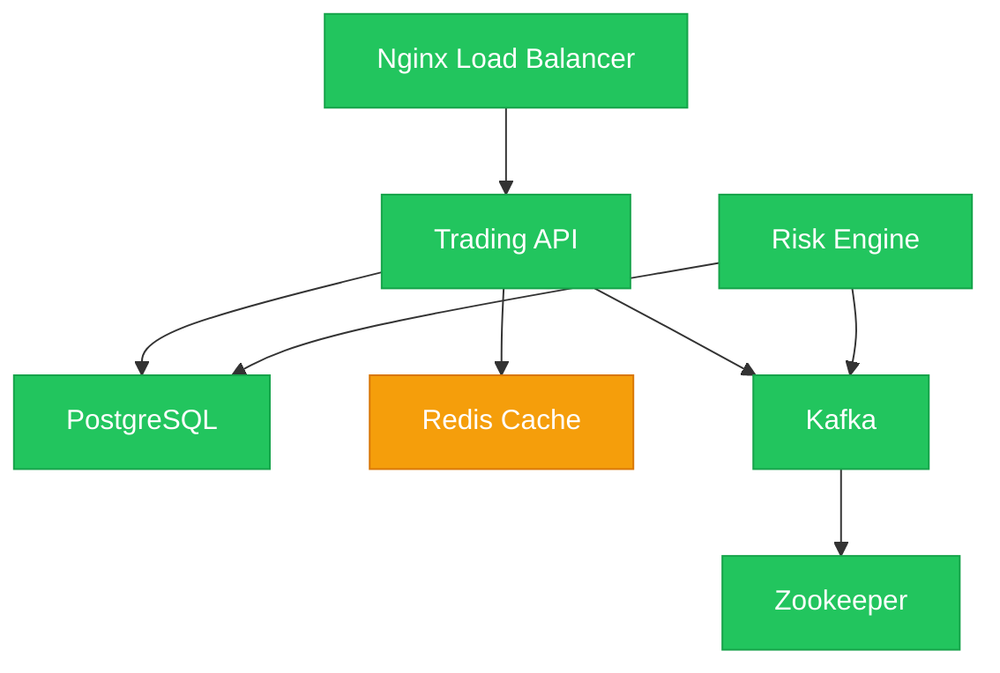

# Use Case: Trading Platform Operations

Ce document décrit un cas d'usage complet d'OpsMap pour gérer une plateforme de trading.

## Contexte

Une entreprise de trading gère une plateforme composée de plusieurs services critiques:
- **API Server** - Serveur REST/WebSocket pour les clients
- **PostgreSQL** - Base de données principale
- **Redis** - Cache et sessions
- **Kafka** - Message broker pour les ordres
- **Risk Engine** - Moteur de calcul des risques

L'équipe d'exploitation doit pouvoir:
1. Visualiser l'état de tous les composants
2. Démarrer/Arrêter des services avec permissions granulaires
3. Recevoir des alertes en temps réel
4. Auditer toutes les actions

## Architecture

```
┌─────────────────────────────────────────────────────────────────┐
│                        FRONTEND                                  │
│                    (React + Vite)                               │
│         Dashboard │ Map View │ Permissions Modal                │
└────────────────────────────┬────────────────────────────────────┘
                             │ REST/WebSocket
┌────────────────────────────┴────────────────────────────────────┐
│                        BACKEND                                   │
│                    (Node.js/TypeScript)                         │
│        API │ Auth │ Permissions │ WebSocket │ Audit             │
└────────────────────────────┬────────────────────────────────────┘
                             │ WebSocket
┌────────────────────────────┴────────────────────────────────────┐
│                        GATEWAY                                   │
│                         (Rust)                                  │
│              Zone: production │ Agent Registry                  │
└───────────────┬─────────────────────────────────┬───────────────┘
                │ WSS + mTLS                       │ WSS + mTLS
┌───────────────┴───────────────┐   ┌─────────────┴───────────────┐
│         AGENT 1               │   │         AGENT 2              │
│      (db-server-01)           │   │      (app-server-01)         │
│  - PostgreSQL                 │   │  - API Server                │
│  - Redis                      │   │  - Risk Engine               │
└───────────────────────────────┘   └──────────────────────────────┘
```

## Configuration de la Map

### map.yaml

```yaml
# maps/trading-platform.yaml
name: trading-platform
version: "1.0"
description: "Plateforme de Trading - Production"

# Définition des composants
components:
  # ═══════════════════════════════════════════════════════════════
  # LOAD BALANCER
  # ═══════════════════════════════════════════════════════════════
  - id: nginx
    name: "Nginx Load Balancer"
    type: proxy
    description: "Répartiteur de charge principal"

    # Agent qui gère ce composant
    agent:
      labels:
        role: proxy
        env: production

    # Checks exécutés localement par l'agent
    checks:
      - name: http_health
        type: http
        config:
          url: http://localhost:80/health
          expected_status: 200
        interval_secs: 30
        timeout_secs: 10

      - name: process_check
        type: process
        config:
          name: nginx
          min_count: 1
        interval_secs: 30
        timeout_secs: 5

    # Actions disponibles
    actions:
      - name: start
        label: "Démarrer"
        command: systemctl start nginx
        async: true

      - name: stop
        label: "Arrêter"
        command: systemctl stop nginx
        async: true
        confirmation_required: true

      - name: restart
        label: "Redémarrer"
        command: systemctl restart nginx
        async: true

      - name: reload
        label: "Recharger config"
        command: systemctl reload nginx
        async: false

  # ═══════════════════════════════════════════════════════════════
  # API SERVER
  # ═══════════════════════════════════════════════════════════════
  - id: api-server
    name: "Trading API"
    type: service
    description: "Serveur API principal"

    # Dépendances (pour le graphe)
    dependencies:
      - postgresql
      - redis
      - kafka

    agent:
      labels:
        role: app
        env: production

    checks:
      - name: http_health
        type: http
        config:
          url: http://localhost:3000/health
          expected_status: 200
        interval_secs: 15
        timeout_secs: 10

      - name: tcp_port
        type: tcp
        config:
          port: 3000
        interval_secs: 30
        timeout_secs: 5

      - name: memory_usage
        type: native:memory
        config:
          warning_percent: 80
          critical_percent: 90
        interval_secs: 60
        timeout_secs: 5

    actions:
      - name: start
        label: "Démarrer"
        command: systemctl start trading-api
        async: true
        completion_check:
          type: http
          config:
            url: http://localhost:3000/health
          timeout_secs: 60

      - name: stop
        label: "Arrêter"
        command: systemctl stop trading-api
        async: true
        confirmation_required: true

      - name: restart
        label: "Redémarrer"
        command: systemctl restart trading-api
        async: true

      - name: clear_cache
        label: "Vider le cache"
        command: curl -X POST http://localhost:3000/admin/clear-cache
        async: false

  # ═══════════════════════════════════════════════════════════════
  # DATABASE
  # ═══════════════════════════════════════════════════════════════
  - id: postgresql
    name: "PostgreSQL"
    type: database
    description: "Base de données principale"

    agent:
      labels:
        role: database
        env: production

    checks:
      - name: tcp_port
        type: tcp
        config:
          port: 5432
        interval_secs: 30
        timeout_secs: 5

      - name: disk_space
        type: native:disk_space
        config:
          path: /var/lib/postgresql
          warning_percent: 70
          critical_percent: 85
        interval_secs: 300
        timeout_secs: 10

      - name: replication_lag
        type: command
        config:
          command: |
            psql -U postgres -t -c "SELECT EXTRACT(EPOCH FROM (now() - pg_last_xact_replay_timestamp()))::int"
        interval_secs: 60
        timeout_secs: 10

    actions:
      - name: start
        label: "Démarrer"
        command: systemctl start postgresql
        async: true

      - name: stop
        label: "Arrêter"
        command: systemctl stop postgresql
        async: true
        confirmation_required: true

      - name: backup
        label: "Backup"
        command: /opt/scripts/pg_backup.sh
        async: true
        run_as_user: postgres

  # ═══════════════════════════════════════════════════════════════
  # CACHE
  # ═══════════════════════════════════════════════════════════════
  - id: redis
    name: "Redis Cache"
    type: cache
    description: "Cache et sessions"

    agent:
      labels:
        role: cache
        env: production

    checks:
      - name: tcp_port
        type: tcp
        config:
          port: 6379
        interval_secs: 30
        timeout_secs: 5

      - name: memory_usage
        type: command
        config:
          command: redis-cli info memory | grep used_memory_human
        interval_secs: 60
        timeout_secs: 5

    actions:
      - name: start
        command: systemctl start redis
        async: true

      - name: stop
        command: systemctl stop redis
        async: true
        confirmation_required: true

      - name: flush_cache
        label: "Vider le cache"
        command: redis-cli FLUSHALL
        async: false
        confirmation_required: true

  # ═══════════════════════════════════════════════════════════════
  # MESSAGE BROKER
  # ═══════════════════════════════════════════════════════════════
  - id: kafka
    name: "Kafka"
    type: messaging
    description: "Message broker pour les ordres"

    dependencies:
      - zookeeper

    agent:
      labels:
        role: messaging
        env: production

    checks:
      - name: tcp_port
        type: tcp
        config:
          port: 9092
        interval_secs: 30
        timeout_secs: 5

      - name: consumer_lag
        type: command
        config:
          command: /opt/kafka/bin/kafka-consumer-groups.sh --bootstrap-server localhost:9092 --describe --all-groups | grep -v TOPIC
        interval_secs: 60
        timeout_secs: 30

    actions:
      - name: start
        command: systemctl start kafka
        async: true

      - name: stop
        command: systemctl stop kafka
        async: true
        confirmation_required: true

  # ═══════════════════════════════════════════════════════════════
  # RISK ENGINE
  # ═══════════════════════════════════════════════════════════════
  - id: risk-engine
    name: "Risk Engine"
    type: service
    description: "Moteur de calcul des risques"

    dependencies:
      - postgresql
      - kafka

    agent:
      labels:
        role: app
        env: production

    checks:
      - name: http_health
        type: http
        config:
          url: http://localhost:8080/health
        interval_secs: 15
        timeout_secs: 10

      - name: cpu_usage
        type: native:cpu
        config:
          warning_percent: 70
          critical_percent: 85
        interval_secs: 30
        timeout_secs: 5

    actions:
      - name: start
        command: systemctl start risk-engine
        async: true

      - name: stop
        command: systemctl stop risk-engine
        async: true
        confirmation_required: true

      - name: recalculate
        label: "Recalculer les risques"
        command: curl -X POST http://localhost:8080/admin/recalculate
        async: true

# ═══════════════════════════════════════════════════════════════
# PERMISSIONS
# ═══════════════════════════════════════════════════════════════
permissions:
  # Groupe SRE - accès complet
  - group: sre-team
    role: admin

  # Opérateurs trading - accès limité
  - group: trading-ops
    role: operator
    overrides:
      components:
        postgresql:
          deny: [stop, restart]
        redis:
          deny: [stop, restart]
        kafka:
          deny: [start, stop, restart]
          allow: [view, logs]
      actions:
        api-server:
          clear_cache: allow
        risk-engine:
          recalculate: allow

  # Développeurs - lecture seule + actions spécifiques
  - group: developers
    role: viewer
    overrides:
      components:
        api-server:
          allow: [view, logs, restart]
      actions:
        api-server:
          clear_cache: allow

  # Bob (consultant externe) - lecture seule
  - user: bob@external.com
    role: viewer
```

## Déploiement des Agents

### Agent sur db-server-01

```yaml
# /etc/opsmap/agent.yaml (sur db-server-01)
agent:
  id: agent-db-prod-01

gateway:
  url: wss://gateway.opsmap.company.com:443
  reconnect_interval_secs: 10

tls:
  enabled: true
  cert_file: /etc/opsmap/certs/agent.crt
  key_file: /etc/opsmap/certs/agent.key
  ca_file: /etc/opsmap/certs/ca.crt

labels:
  role: database
  env: production
  datacenter: dc1
```

### Agent sur app-server-01

```yaml
# /etc/opsmap/agent.yaml (sur app-server-01)
agent:
  id: agent-app-prod-01

gateway:
  url: wss://gateway.opsmap.company.com:443
  reconnect_interval_secs: 10

tls:
  enabled: true
  cert_file: /etc/opsmap/certs/agent.crt
  key_file: /etc/opsmap/certs/agent.key
  ca_file: /etc/opsmap/certs/ca.crt

labels:
  role: app
  env: production
  datacenter: dc1
```

## Scénarios d'utilisation

### 1. Démarrage matinal

L'opérateur Alice se connecte le matin pour vérifier l'état de la plateforme:

1. **Login**: `alice@company.com` avec SSO
2. **Dashboard**: Vue d'ensemble de toutes les maps accessibles
3. **Trading Platform**: Clic sur la map pour voir le graphe
4. **Statuts**: Tous les composants en vert ✅

### 2. Incident Redis

Redis tombe en panne:

1. **Alerte temps réel**: Le composant Redis passe en rouge
2. **Notification**: L'équipe SRE reçoit une alerte
3. **Diagnostic**: Clic sur Redis pour voir les détails
   - Check `tcp_port` en erreur
   - Logs disponibles
4. **Action**: Clic sur "Démarrer"
5. **Suivi**: Status passe en jaune (démarrage) puis vert
6. **Audit**: Action loggée avec utilisateur et timestamp

### 3. Déploiement API

Le développeur Bob veut redémarrer l'API après un déploiement:

1. **Permissions**: Bob a le droit de restart sur `api-server`
2. **Action**: Clic sur "Redémarrer" sur api-server
3. **Confirmation**: Dialog de confirmation
4. **Exécution**: Agent exécute `systemctl restart trading-api`
5. **Completion**: Check HTTP vérifie que l'API répond

### 4. Opération interdite

L'opérateur essaie d'arrêter PostgreSQL:

1. **Action**: Clic sur "Arrêter" sur PostgreSQL
2. **Refus**: Message "Permission denied"
3. **Audit**: Tentative loggée avec raison du refus

## Graphe Mermaid généré



## API Calls - Exemples

### Authentification

```bash
# Login
curl -X POST http://localhost:3000/api/v1/auth/login \
  -H "Content-Type: application/json" \
  -d '{"email": "alice@company.com", "password": "secret"}'

# Response
{
  "user": { "id": "...", "email": "alice@company.com", "name": "Alice" },
  "token": "eyJhbGciOiJIUzI1NiIs...",
  "refreshToken": "..."
}
```

### Lister les Maps

```bash
curl http://localhost:3000/api/v1/maps \
  -H "Authorization: Bearer $TOKEN"

# Response
{
  "data": [
    {
      "id": "uuid",
      "name": "Trading Platform",
      "slug": "trading-platform",
      "description": "Plateforme de Trading - Production"
    }
  ]
}
```

### Exécuter une action

```bash
# Redémarrer l'API server
curl -X POST http://localhost:3000/api/v1/maps/$MAP_ID/components/api-server/restart \
  -H "Authorization: Bearer $TOKEN"

# Response
{
  "message": "Restart command queued",
  "jobId": "job-uuid"
}
```

### WebSocket - Temps réel

```javascript
const ws = new WebSocket('ws://localhost:3000/ws?token=' + token);

// S'abonner aux updates d'une map
ws.send(JSON.stringify({
  type: 'subscribe',
  payload: { mapId: 'map-uuid' }
}));

// Recevoir les updates
ws.onmessage = (event) => {
  const msg = JSON.parse(event.data);
  if (msg.type === 'map_update') {
    console.log('Component status changed:', msg.payload);
  }
};
```

## Audit Trail

Toutes les actions sont auditées:

```json
{
  "id": "audit_123",
  "timestamp": "2026-01-31T10:15:00Z",
  "action": "component.restart",
  "actor": {
    "type": "user",
    "id": "user_alice",
    "email": "alice@company.com",
    "ip": "10.0.1.50"
  },
  "target": {
    "type": "component",
    "mapId": "map_trading",
    "componentId": "api-server"
  },
  "details": {
    "jobId": "job_456",
    "status": "queued"
  }
}
```

## Monitoring

### Prometheus Metrics (Gateway)

```
# Agents connectés
opsmap_gateway_connected_agents 5

# Commandes exécutées
opsmap_gateway_commands_total{status="success"} 150
opsmap_gateway_commands_total{status="failed"} 3

# Latence des checks
opsmap_agent_check_duration_seconds{component="api-server",check="http_health"} 0.045
```

### Alertes

Configurez vos alertes Prometheus/Alertmanager:

```yaml
groups:
  - name: opsmap
    rules:
      - alert: ComponentDown
        expr: opsmap_component_status{status="error"} == 1
        for: 2m
        labels:
          severity: critical
        annotations:
          summary: "Component {{ $labels.component }} is down"
```

## Conclusion

OpsMap fournit une solution complète pour:
- ✅ Visualiser l'architecture et les dépendances
- ✅ Monitorer en temps réel avec checks autonomes
- ✅ Exécuter des actions avec permissions granulaires
- ✅ Auditer toutes les opérations
- ✅ Intégrer avec l'existant (OIDC, Prometheus, etc.)
